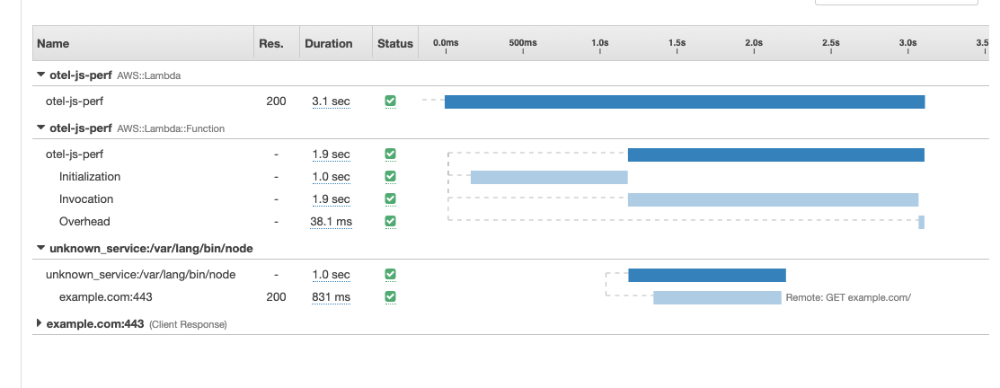

# Setup

1. Create a new lambda function and call it "otel-js-perf"
2. Choose the Node.js 14.x runtime
3. In this repo, run `npm install` followed by `sh upload.sh`
4. Add a layer to the lambda function, use the appropriate region: https://aws-otel.github.io/docs/getting-started/lambda/lambda-js
5. Set the environment variable `NODE_OPTIONS` to `--require src/tracing`
6. Enable "Active tracing" under _Configuration > Monitoring_
7. Ensure the lambda execution role has permission to create XRay traces, the Console should automatically do this for you at Step (7)
8. Increase the timeout to 30 seconds under _Configuration > General_
9. Run a test
10. Open X-Ray to find the trace your function created. It will resemble this:

## Performance notes

* The function takes around 3 seconds to execute with instrumentation
  * and roughly 1 second without
* You can experiment by:
  * Removing the lambda layer
  * Removing the NODE_OPTIONS env var
  * Both of the above
* Generally I have found the following performance impacts:
  * The lambda layer adds ~300ms
  * The tracing.js file adds 500-700ms
  * Sometimes, there is ~1000ms of unexplained time after the handler has exited
* Be aware of when your test is running cold or warm
  * if warm, the "Initialization" span will be missing, and the function completes much quicker
